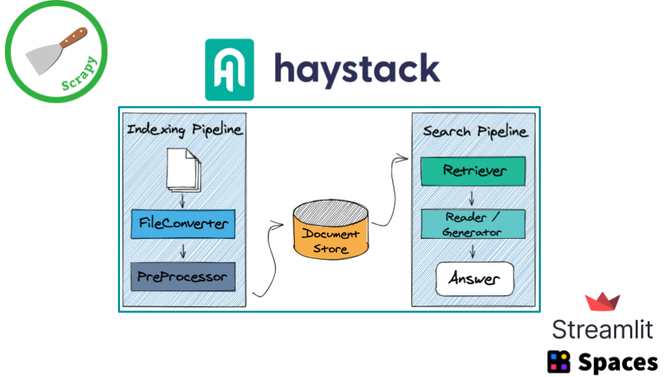

# Who killed Laura Palmer? &nbsp;  

## 🗻🗻 Twin Peaks Question Answering system

WKLP is a simple Question Answering system, based on data crawled from [Twin Peaks Wiki](https://twinpeaks.fandom.com/wiki/Twin_Peaks_Wiki). It is built using [🔍 Haystack](https://github.com/deepset-ai/haystack), an awesome open-source framework for building search systems that work intelligently over large document collections.

  - [Project architecture 🧱](#project-architecture-)
  - [What can I learn from this project? 📚](#what-can-i-learn-from-this-project-)
  - [Repository structure 📁](#repository-structure-)
  - [Installation 💻](#installation-)
  - [Possible improvements ✨](#possible-improvements-)
---

## Project architecture 🧱

 

* Crawler: implemented using [Scrapy](https://github.com/scrapy/scrapy) and [fandom-py](https://github.com/NikolajDanger/fandom-py)
* Question Answering pipelines: created with [Haystack](https://github.com/deepset-ai/haystack)
* Web app: developed with [Streamlit](https://github.com/streamlit/streamlit)
* Free hosting: [Hugging Face Spaces](https://huggingface.co/spaces)

---

## What can I learn from this project? 📚
- How to quickly ⌚ build a modern Question Answering system using [🔍 Haystack](https://github.com/deepset-ai/haystack)
- How to generate questions based on your documents
- How to build a nice [Streamlit](https://github.com/streamlit/streamlit) web app to show your QA system
- How to optimize the web app to 🚀 deploy in [🤗 Spaces](https://huggingface.co/spaces)

## Repository structure 📁
- [app.py](./app.py): Streamlit web app
- [app_utils folder](./app_utils/): python modules used in the web app
- [crawler folder](./crawler/): Twin Peaks crawler, developed with Scrapy and fandom-py
- [notebooks folder](./notebooks/): Jupyter/Colab notebooks to create the Search pipeline and generate questions (using Haystack)
- [data folder](./data/): all necessary data

Within each folder, you can find more in-depth explanations.

## Installation 💻
To install this project locally, follow these steps:
- `git clone https://github.com/anakin87/who-killed-laura-palmer`
- `cd who-killed-laura-palmer`
- `pip install -r requirements.txt`

To run the web app, simply type: `streamlit run app.py`

## Possible improvements ✨
### Project structure
- The project is optimized to be deployed in Hugging Face Spaces and consists of an all-in-one Streamlit web app. In more structured production environments, I suggest dividing the software into three parts:
  - Haystack backend API (as explained in [the official documentation](https://haystack.deepset.ai/components/rest-api))
  - Document store service
  - Streamlit web app
### Reader
- The reader model (`deepset/roberta-base-squad2`) is a good compromise between speed and accuracy, running on CPU. There are certainly better (and more computationally expensive) models, as you can read in the [Haystack documentation](https://haystack.deepset.ai/pipeline_nodes/reader).
- You can also think about preparing a Twin Peaks QA dataset and fine-tuning the reader model to get better accuracy, as explained in this [Haystack tutorial](https://haystack.deepset.ai/tutorials/fine-tuning-a-model).

